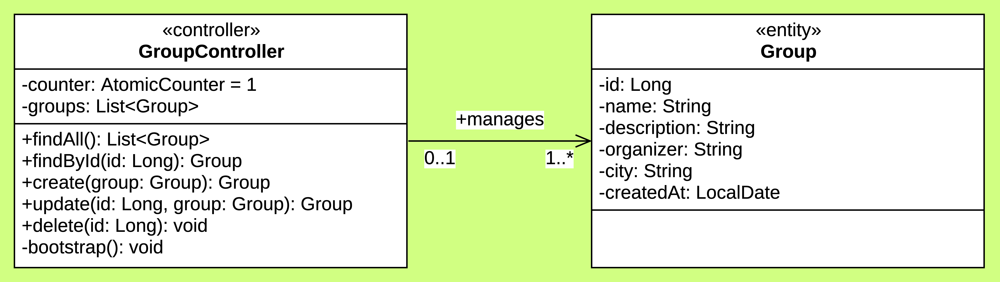

<hr>

<div align="center">
  <p></p>
  <sub>BACKEND</sub>
  <h1>RESTMEET</h1>
  <p>Minimal REST meetup API with clearly structured group management via basic CRUD, covering creation, lookup, update, and removal, without complicating the overall structure or adding unnecessary overhead.
</div>

<hr>

### Main Features

- Full CRUD with REST endpoints.
- In-memory storage, no database.
- Auto-incremented IDs via atomic counter.
- One group pre-seeded on startup.

<hr>

### UML Diagram

<p></p>

<hr>

### Updating Maven Wrapper

Here is how to update Maven wrapper:

```shell
address="https://maven.apache.org/download.cgi"
pattern="Apache Maven [0-9]+\.[0-9]+\.[0-9]+"
version="$(curl -s "$address" | grep -A2 'id="CurrentMaven"' | grep -oE "$pattern" | head -1 | awk '{print $3}')"
./mvnw -N wrapper:wrapper -Dmaven="$version"
```

<hr>

### Filling StarUML Exports

Here is how to fill StarUML exports:

```shell
magick .assets/input.png -background "#d1ff82" -flatten .assets/output.png
```

<hr>